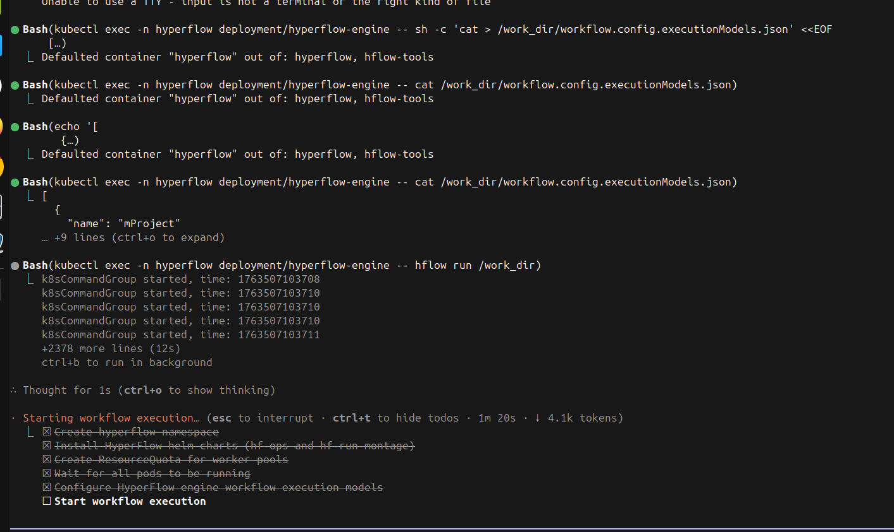
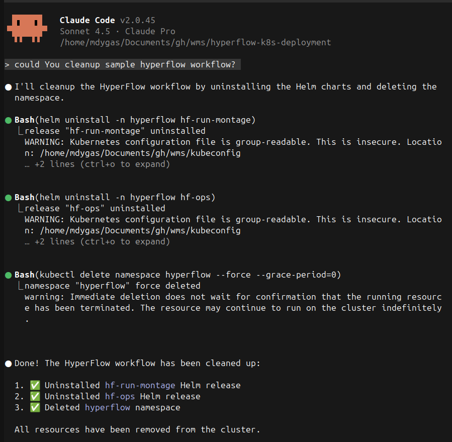

# Run HyperFlow workflow using LLM

Examples how to execute a **sample HyperFlow workflow using common LLM providers**.

## Claude Code

**Note:** requires PRO paid plan

1. Install Claude Code locally

https://code.claude.com/docs/en/setup

```
curl -fsSL https://claude.ai/install.sh | bash
```

2. Create local kubernetes cluster 

Create a [local kind kubernetes cluster](https://kind.sigs.k8s.io/docs/user/quick-start/#installing-with-a-package-manager) in case You dont have access to an external Kubernetes cluster (EKS, GKE, AKE etc.)

```bash
kind create cluster --config local/kind-config-3n.yaml
```

3. Ensure kubernetes cluster connectivity

```bash
$ kubectl cluster-info
Kubernetes control plane is running at https://127.0.0.1:41045
CoreDNS is running at https://127.0.0.1:41045/api/v1/namespaces/kube-system/services/kube-dns:dns/proxy

To further debug and diagnose cluster problems, use 'kubectl cluster-info dump'.
```

4. Change directory to root of the repository

```bash
$ pwd
/(...)/wms/hyperflow-k8s-deployment
```

5. Ask Claude to run simple HyperFlow workflow

```bash
claude "Hi, could You run me a sample hyperflow workflow?"
```



6. Cleanup HyperFlow instalation

```bash 
claude "could You cleanup sample hyperflow workflow?"
```

